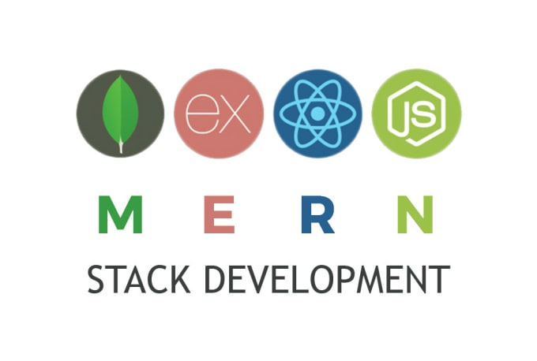
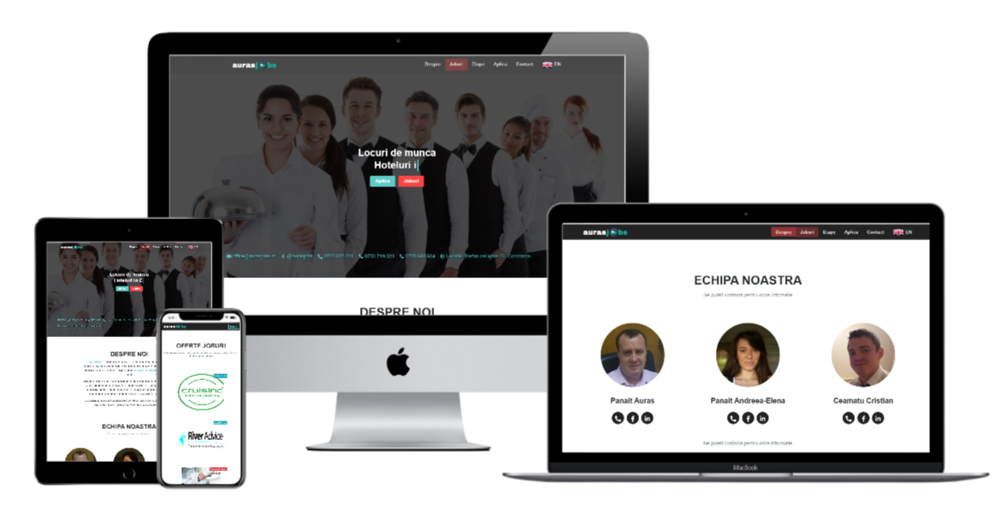

 
# 

> ### This project is a rebuild version of the single-page website [aurasjobs.ro](https://github.com/cristianCeamatu/aurasjobs.ro-laravel) which current working version is built with Laravel/PHP. The original app is used in production for a Recruiting agency, candidates can apply directly through a form on the website. The client will receive an email for each application or contact request, currently working on an admin page where he can manage the database of the candidate's applications and contact requests. The website is mobile responsive.

### This website was created in order to change the stack of the original website from Laravel to MERN.

## Website mockup



[Live Demo link](https://aurasjobs-mern.herokuapp.com/)

## Built With

- Node Js
- Express Js
- React Js

### Other used modules
- **Nodemailer** to send emails
- **Handlebars** for email templating
- **Axios** to handle requests
- **Dotenv**: handling config variable in the backend
- **React-helmet** for the meta tags
- **React-hook-form**: to handle forms submission
- **React-scroll** animates scrolling to sections on the page
- **React-typed**: typed effect on the showcase component
- **Reactstrap**: good-looking design components, in react!

## Future features

Currently working on the internationalization using the react-i18next package.

# Getting started

## Prerequisites
1. Node/NPM - [Installing Node](https://nodejs.org/en/)

## Installation

Clone the repository

    git clone git@github.com:cristianCeamatu/aurasjobs-mern.git

Switch to the repo folder

    cd aurasjobs.ro-mern

Install all the dependencies in the backend folder

    cd backend && npm install

Switch to the root folder again

    cd ..

Install all the dependencies in the frontend folder

    cd frontend && npm install

Switch to the root folder again

    cd ..

Start the local development server, run the following script from the backend folder

    npm run dev

You can now access the website at http://localhost:3000 . The page will reload if you make edits and will sync with other connected devices.<br /> You will also see any lint errors in the console.

If you want to use the mail functionality on submitting forms you need to:
    `cd backend/config && cp config.env.example config.env`
Then you open config.env and add you mail account details.

**TL;DR command list**

```
    git clone git@github.com:cristianCeamatu/aurasjobs-mern.git
    cd aurasjobs.ro-mern
    cd backend && npm install
    cd ..
    cd frontend && npm install
    cd ..
    npm run dev

```

## Other available Scripts

In the project directory, you can run:

### `npm start` from the frontend folder

Local:            http://localhost:3000/(http://localhost:3000)
On Your Network:  http://192.168.56.1:3000/(http://192.168.56.1:3000/)

The page will reload if you make edits and will sync with other connected devices.<br />
You will also see any lint errors in the console.

### `npm run build` from the client folder

Builds the app for production to the `build` folder.<br />
It correctly bundles React in production mode and optimizes the build for the best performance.

The build is minified and the filenames include the hashes.<br />
Your app is ready to be deployed!

See the section about [deployment](https://facebook.github.io/create-react-app/docs/deployment) for more information.

### `npm run eject` from the client folder

**Note: this is a one-way operation. Once you `eject`, you can’t go back!**

If you aren’t satisfied with the build tool and configuration choices, you can `eject` at any time. This command will remove the single build dependency from your project.

Instead, it will copy all the configuration files and the transitive dependencies (webpack, Babel, ESLint, etc) right into your project so you have full control over them. All of the commands except `eject` will still work, but they will point to the copied scripts so you can tweak them. At this point you’re on your own.

You don’t have to ever use `eject`. The curated feature set is suitable for small and middle deployments, and you shouldn’t feel obligated to use this feature. However we understand that this tool wouldn’t be useful if you couldn’t customize it when you are ready for it.

## Authors

👤 **Cristian Viorel Ceamatu**

- Email: [cristian.ceamatu@gmail.com](cristian.ceamatu@gmail.com)
- Github: [https://github.com/cristianCeamatu](https://github.com/cristianCeamatu)
- Twitter: [https://twitter.com/CeamatuV](https://twitter.com/CeamatuV)
- Linkedin: [https://www.linkedin.com/in/ceamatu-cristian-viorel-7a5469136/](https://www.linkedin.com/in/ceamatu-cristian-viorel-7a5469136/)

## Show your support

Give a ⭐️ if you like this project!

## 📝 License

This project is [MIT](lic.url) licensed.
